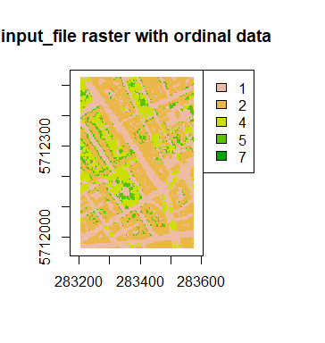
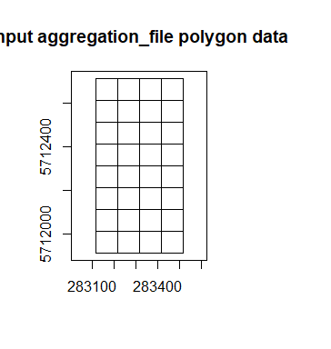

RVaggregator
============

Raster and Vector spatial aggregation tool

Summary
-------

RVaggregator aims to ease aggregation of spatial data. Aggregation
involves the coarsening of a high resolution dataset (raster) across a
lower resolution raster or polygon(s).

I have not found an “all in one” and relatively fast aggregation
solution in e.g. R/python/gdal etc that I like. RVaggregator allows you
to: - Define a flexible range of statistics (cf. e.g. gdal which has a
finite number of pre-compiled functions - it only had “sum” introduced
in ~2019) - Parallelise processing across a range of input datasets -
Output neat shapefiles and 2D/3D rasters. - Work with ordinal (e.g. land
cover class) and continuous (e.g. heights) inputs - Avoid the headache
of having to make a specific bit of code for a specific aggregation

Also comes with command line interface wrapper in
`CLI/RVaggregator-CLI.R`.

Install
-------

wip

Command line use
----------------

wip

R use
-----

wip

    library(RVaggregator)
    library(terra)

    ## Warning: package 'terra' was built under R version 4.0.3

    ## terra version 0.8.6 (beta-release)

    plot(rast("data/sample/sample_input_raster_ordinal.tif"), main = "input_file raster with ordinal data")

    plot(vect("data/sample/sample_shapefile/sample_shapefile.shp"), "Input aggregation_file polygon data")

    aggregated_data <- RVaggregator(input_file = "data/sample/sample_input_raster_ordinal.tif",
                 aggregation_file = "data/sample/sample_shapefile/sample_shapefile.shp",
                 aggregation_type = "fraction",
                 output_directory = "data/sample/output",
                 poly_chunk_size = 500)

    ## Loading required package: tools

    ## Loading required package: dplyr

    ## Warning: package 'dplyr' was built under R version 4.0.3

    ## 
    ## Attaching package: 'dplyr'

    ## The following object is masked from 'package:terra':
    ## 
    ##     select

    ## The following objects are masked from 'package:stats':
    ## 
    ##     filter, lag

    ## The following objects are masked from 'package:base':
    ## 
    ##     intersect, setdiff, setequal, union

    ## Loading required package: tidyr

    ## Warning: package 'tidyr' was built under R version 4.0.3

    ## 
    ## Attaching package: 'tidyr'

    ## The following objects are masked from 'package:terra':
    ## 
    ##     expand, extract, fill, pack

    ## [1] "1 / 1"

    ## Warning in cbind(ID = i, matrix(unlist(r[[i]]), ncol = length(r[[i]]))): number
    ## of rows of result is not a multiple of vector length (arg 1)

    ## Warning in cbind(ID = i, matrix(unlist(r[[i]]), ncol = length(r[[i]]))): number
    ## of rows of result is not a multiple of vector length (arg 1)

    ## Warning in cbind(ID = i, matrix(unlist(r[[i]]), ncol = length(r[[i]]))): number
    ## of rows of result is not a multiple of vector length (arg 1)

    ## Warning in cbind(ID = i, matrix(unlist(r[[i]]), ncol = length(r[[i]]))): number
    ## of rows of result is not a multiple of vector length (arg 1)

    ## [1] "0.01 min"

The output data has same format as `aggregation_file`

    class(aggregated_data)

    ## [1] "SpatVector"
    ## attr(,"package")
    ## [1] "terra"

Unlike `aggregation_file` , the polygons (each with unique ID) contain
the data

    head(aggregated_data)

    ##   ID     fpx_1     fpx_2     fpx_4      fpx_5
    ## 1  1        NA        NA        NA         NA
    ## 2  2        NA        NA        NA         NA
    ## 3  3        NA        NA        NA         NA
    ## 4  4        NA        NA        NA         NA
    ## 5  5 0.4444444 0.0000000 0.5555556 0.00000000
    ## 6  6 0.2266667 0.6266667 0.1333333 0.01333333
