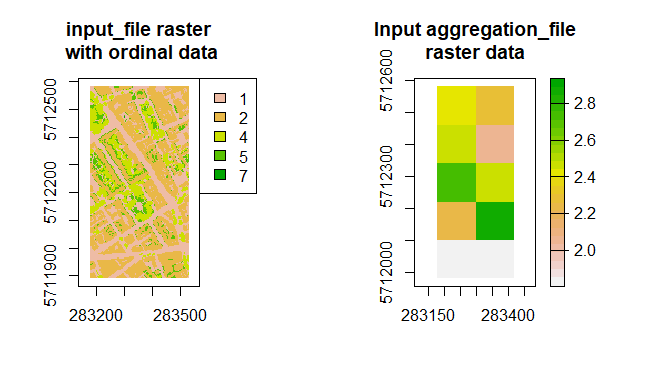

RVaggregator
============

Raster and Vector spatial aggregation tool

Summary
-------

RVaggregator aims to ease aggregation of spatial data. Aggregation
involves the coarsening of a high resolution dataset (raster) across a
lower resolution raster or polygon(s).

I have not found an “all in one” and relatively fast aggregation
solution in e.g. R/python/gdal etc that I like. RVaggregator allows you
to:

-   Define a flexible range of statistics (cf. e.g. gdal which has a
    finite number of pre-compiled functions - it only had “sum”
    introduced in ~2019)
-   Parallelise processing across a range of input datasets
-   Output neat shapefiles and 2D/3D rasters.
-   Work with ordinal (e.g. land cover class) and continuous
    (e.g. heights) inputs
-   Avoid the headache of having to make a specific bit of code for a
    specific aggregation

Also comes with command line interface wrapper in
`CLI/RVaggregator-CLI.R`.

Install
-------

Start up R and run:

    install.packages("devtools")
    devtools::install_github("willmorrison1/RVaggregator")

The required packages should then be installed.

Command line use
----------------

The repo comes with a CLI wrapper e.g.

     R.exe CLI/RVaggregator-CLI.R

When run without arguments it will give a prompt on required inputs

    usage: RVaggregator [--] [--help] [--opts OPTS] [--cache_directory CACHE_DIRECTORY] [--memory_fraction
           MEMORY_FRACTION] [--aggregation_chunk_size AGGREGATION_CHUNK_SIZE] [--aggregate_ordinal
           AGGREGATE_ORDINAL] input_file aggregation_file output_directory

Follow the R use to get the same variable names and descriptions
required for the CLI inputs.

R use
-----

    library(RVaggregator)

    par(mfrow = c(1, 3))
    plot(rast("data/sample/input/sample_input_raster_ordinal.tif"), main = "input_file raster with ordinal data")

    plot(vect("data/sample/input/sample_shapefile/sample_shapefile.shp"), main = "Input aggregation_file polygon data")

    plot(rast("data/sample/input/sample_input_raster_ordinal.tif"), main = "Both")
    plot(vect("data/sample/input/sample_shapefile/sample_shapefile.shp"), add = TRUE)

    aggregated_data <- RVaggregator(input_file = "data/sample/input/sample_input_raster_ordinal.tif",
                                    aggregation_file = "data/sample/input/sample_shapefile/sample_shapefile.shp",
                                    aggregation_type = "fraction",
                                    output_directory = "data/sample/output",
                                    poly_chunk_size = 500)

    ## [1] "1 / 1"
    ## [1] "0.01 min"

The output data has same format as `aggregation_file`

    class(aggregated_data)

    ## [1] "SpatVector"
    ## attr(,"package")
    ## [1] "terra"

Unlike `aggregation_file` , the polygons (each with unique ID) contain
the data

    head(aggregated_data)

    ##   ID     fpx_1     fpx_2     fpx_4      fpx_5
    ## 1  1        NA        NA        NA         NA
    ## 2  2        NA        NA        NA         NA
    ## 3  3        NA        NA        NA         NA
    ## 4  4        NA        NA        NA         NA
    ## 5  5 0.3411765 0.2235294 0.3705882 0.06470588
    ## 6  6 0.2729412 0.5811765 0.1152941 0.03058824

You can also do the aggreagation using rasters, where `aggregation_file`
raster has lower spatial resolution than `input_file`.

    par(mfrow = c(1, 2))
    plot(rast("data/sample/input/sample_input_raster_ordinal.tif"), main = "input_file raster\n with ordinal data")

    plot(rast("data/sample/input/aggregation_file.tif"), main = "Input aggregation_file\nraster data")

    aggregated_data <- RVaggregator(input_file = "data/sample/input/sample_input_raster_ordinal.tif",
                                    aggregation_file = "data/sample/input/aggregation_file.tif",
                                    aggregation_type = "fraction",
                                    output_directory = "data/sample/output",
                                    poly_chunk_size = 500)

    ## [1] "1 / 1"
    ## [1] "0.01 min"

When `aggregation_file` is raster, output is also raster with 3rd
dimension with names of stats

    class(aggregated_data)

    ## [1] "SpatRaster"
    ## attr(,"package")
    ## [1] "terra"

    names(aggregated_data)

    ## [1] "ID"    "fpx_1" "fpx_2" "fpx_4" "fpx_5" "fpx_7"

Plot the second variable of the `aggregated_data`

    print(names(aggregated_data)[2])

    ## [1] "fpx_1"

    plot(aggregated_data[[2]], main = "Aggregated data,\nsecond stat")

