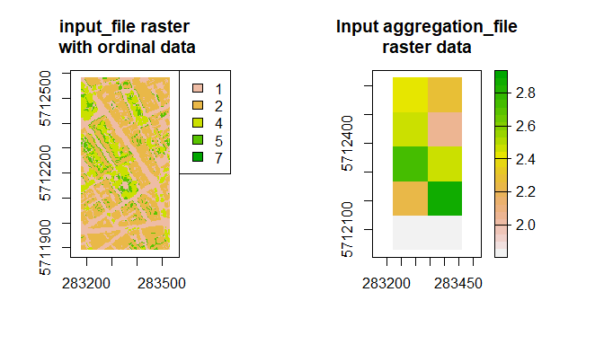

RVaggregator
============

Raster and Vector spatial aggregation tool

Summary
-------

RVaggregator aims to ease aggregation of spatial data. Aggregation
involves the coarsening of a high spatial resolution raster across
rasters or polygons of lower resolution. Specifically, RVaggregator is a
convenience wrapper for `terra::extract()`.

I have not found an “all in one” and relatively fast aggregation
solution in e.g. R/python/gdal etc that I like. RVaggregator can:

-   Work with ordinal (e.g. land cover class) and continuous
    (e.g. heights) inputs
-   Aggregate data through command line `CLI/RVaggregator-CLI.R` (cf. R
    IDE or program - but you still need R!)
-   Accurately account for cell sizes and grid mismatches when
    aggregating, rather than aggregating by a factor of *n* (e.g. *n* =
    2 = half the resolution)
-   Avoid loading all data into memory at once (currently a very crude
    implementation)
-   Define a flexible range of aggregation statistics (cf. e.g. gdal
    which has a finite number of pre-compiled functions - it only had
    “sum” introduced in ~2019) *wip*
-   Output neat shapefiles and 2D/3D rasters.

Install
-------

Start up R (tested on R 3.5 and R 4.0) and run:

    install.packages("devtools")
    devtools::install_github("willmorrison1/RVaggregator")

If you run into issues with dependencies (typically R 4.0), try this

    Sys.setenv("R_REMOTES_NO_ERRORS_FROM_WARNINGS"="True")
    devtools::install_github("willmorrison1/RVaggregator")

The required packages should then be installed.

R use
-----

    library(RVaggregator)

    par(mfrow = c(1, 3))
    plot(rast("data/sample/input/sample_input_raster_ordinal.tif"), main = "input_file raster with ordinal data")

    plot(vect("data/sample/input/sample_shapefile/sample_shapefile.shp"), main = "Input aggregation_file polygon data")

    plot(rast("data/sample/input/sample_input_raster_ordinal.tif"), main = "Both")
    plot(vect("data/sample/input/sample_shapefile/sample_shapefile.shp"), add = TRUE)

    aggregated_data <- RVaggregator(input_file = "data/sample/input/sample_input_raster_ordinal.tif",
                                    aggregation_file = "data/sample/input/sample_shapefile/sample_shapefile.shp",
                                    aggregation_type = "fraction",
                                    output_directory = "data/sample/output",
                                    poly_chunk_size = 500)

    ## [1] "1 / 1"
    ## [1] "0.01 min"

The output data has same format as `aggregation_file`

    class(aggregated_data)

    ## [1] "SpatVector"
    ## attr(,"package")
    ## [1] "terra"

Unlike `aggregation_file` , the polygons (each with unique ID) contain
the data

    head(aggregated_data)

    ##   ID     fpx_1 npx     fpx_2     fpx_4      fpx_5
    ## 1  1 0.0000000   0 0.0000000 0.0000000 0.00000000
    ## 2  2 0.0000000   0 0.0000000 0.0000000 0.00000000
    ## 3  3 0.0000000   0 0.0000000 0.0000000 0.00000000
    ## 4  4 0.0000000   0 0.0000000 0.0000000 0.00000000
    ## 5  5 0.3411765 170 0.2235294 0.3705882 0.06470588
    ## 6  6 0.2729412 425 0.5811765 0.1152941 0.03058824

You can also do the aggreagation using rasters, where `aggregation_file`
raster has lower spatial resolution than `input_file`.

    par(mfrow = c(1, 2))
    plot(rast("data/sample/input/sample_input_raster_ordinal.tif"), main = "input_file raster\n with ordinal data")

    plot(rast("data/sample/input/aggregation_file_shifted.tif"), main = "Input aggregation_file\nraster data")

    aggregated_data <- RVaggregator(input_file = "data/sample/input/sample_input_raster_ordinal.tif",
                                    aggregation_file = "data/sample/input/aggregation_file_shifted.tif",
                                    aggregation_type = "fraction",
                                    output_directory = "data/sample/output",
                                    poly_chunk_size = 500)

    ## [1] "1 / 1"
    ## [1] "0.01 min"

When `aggregation_file` is raster, output is also raster with 3rd
dimension with names of stats

    class(aggregated_data)

    ## [1] "SpatRaster"
    ## attr(,"package")
    ## [1] "terra"

    names(aggregated_data)

    ## [1] "ID"    "fpx_1" "npx"   "fpx_2" "fpx_4" "fpx_5" "fpx_7"

Plot the second variable of the `aggregated_data`

    print(names(aggregated_data)[2])

    ## [1] "fpx_1"

    plot(aggregated_data[[2]], main = "Aggregated data,\nsecond stat")

Poly\_chunk\_size
-----------------

This parameter is most important and defines memory usage. Assuming
input\_file resolution is &gt;= 1 m, the number of data points
`n_data_points` loaded into memory at one time follows:

`n_data_points = ((poly_chunk_size*aggregation_dataset_area)/input_file_cell_area)*number_of_statistics`

where `aggregation_dataset_area` is the area of the aggregating polygon
or cell (m^2), `input_file_cell_area` is the resolution of the input
raster (m^2) and `number_of_statistics` is the number of aggregating
statistics used. For `aggregation_type = "fraction"`,
`number_of_statistics` is the number of ordinal classes + 2. For
`aggregation_type = "distribution"`, it is set by the number of
functions in `getManualFunctions()` + 2.

With `poly_chunk_size` set to 50, `aggregation_dataset_area` 22500 m^2
(a grid of 150 x 150 m polygons), `input_file_cell_area` 25 m^2 (5 m
horizontal, 5 m vertical resolution), with an `input_file` a land cover
map with 5 classes, then:

`n_data_points = ((50 * 22500) / 25) * (5 + 2) = 315000` points loaded
at any one time

`n_data_points` increases when: cell size decreases,
`aggregation_dataset_area` increases, `poly_chunk_size` increases,
`number_of_statistics` increases. Computation time increases as
`poly_chunk_size` decreases (R overhead).

Command line use
----------------

The repo comes with a CLI wrapper e.g.

     R RVaggregator-CLI.R

or

     R --no-save <RVaggregator-CLI.R

When run without arguments it will give a prompt and long description on
the required inputs. the short description is:

    usage: RVaggregator [--] [--help] [--opts OPTS] [--cache_directory CACHE_DIRECTORY] [--memory_fraction
           MEMORY_FRACTION] [--aggregation_chunk_size AGGREGATION_CHUNK_SIZE] [--aggregate_ordinal
           AGGREGATE_ORDINAL] input_file aggregation_file output_directory

Follow the “R use” section to familiarise yourself with the variable
names and descriptions required for the CLI inputs.

A sample command line execution under windows would be

     & "C:\Program Files\R\R-4.0.2\bin\Rscript.exe" .\CLI\RVaggregator-CLI.R data/sample/input/sample_input_raster_ordinal.tif data/sample/input/sample_shapefile/sample_shapefile.shp C:\Users\willm\Desktop\ --aggregate_ordinal TRUE
